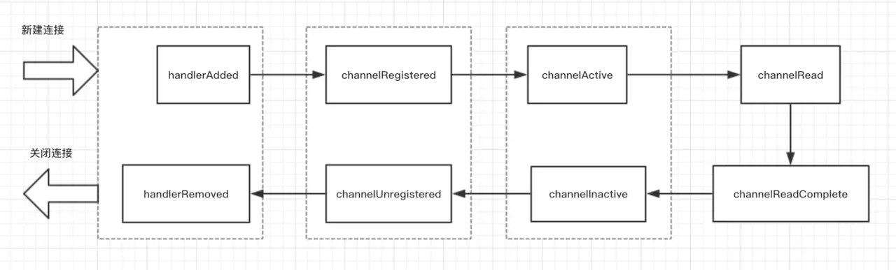

# 计算机中的 bit byte short int long 
> 所谓字节,原意就是用来表示一个完整的字符的。最初的计算机性能和存储容量都比较差,所以普遍采用4位BCD编码(这个编码出现比计算机还早,最早是用在打孔卡上的)。BCD编码表示数字还可以,但表示字母或符号就很不好用,需要用多个编码来表示。后来又演变出6位的BCD编码(BCDIC),以及至今仍在广泛使用的7位ASCII编码。不过最终决定字节大小的,是大名鼎鼎的System/360。当时IBM为System/360设计了一套8位EBCDIC编码,涵盖了数字、大小写字母和大部分常用符号,同时又兼容广泛用于打孔卡的6位BCDIC编码。System/360很成功,也奠定了字符存储单位采用8位长度的基础,这就是1字节=8位的由来。
1. 位(bit), 表示二进制位. 位是计算机内部数据储存的最小单位，11010100是一个8位二进制数。一个二进制位只可以表示0和1两种状态（2^1）
2. 字节（byte），习惯上用大写的“B”表示。字节是计算机中数据处理的基本单位。计算机中以字节为单位存储和解释信息，规定一个字节由八个二进制位构成，即1个字节等于8个比特（1Byte=8bit）。八位二进制数最小为00000000，最大为11111111；通常1个字节可以存入一个ASCII码，2个字节可以存放一个汉字国标码。

# JAVA中 byte转int
### 原码,反码,补码概念
- 原码

        +1原 = 0000 0001
        -1原 = 1000 0001
- 反码 

        正数的反码是其本身
        负数的反码是在其原码的基础上, 符号位不变，其余各个位取反.
- 补码
        
        正数的补码就是其本身
        负数的补码是在其原码的基础上, 符号位不变, 其余各位取反, 最后+1. (即在反码的基础上+1)
### byte转int
#### 在这之前， 我们要先学习一下十进制转而二进制
> 你以十进制的数除以你所要转换的进制数,把每次除得的余数记在旁边,所得的商数继续除以进制数,直到余数为0时止.例如你要把100转换成八进制:  
> 100/8=12...(余数为4);  
> 12/8=1.....(余数为4);  
> 1/8=0......(余数为1);  
> 然后把相应的**余数从低向高顺着写出来**,如上的为144,此即为100的八进制表示形式.  
> 十进制转换为十六进制与二进制与前面的转化为八进制相同,如100转换为十六进制:  
> 100/16=6....(余数为4);  
> 6/16=0......(余数为6);  
> 同理则以十六进制表示的100形式为64;  
> 100转换为二进制:  
> 100/2=50....(余数为0);  
> 50/2=25.....(余数为0);  
> 25/2=12.....(余数为1);  
> 12/2=6......(余数为0);  
> 6/2=3.......(余数为0);  
> 3/2=1.......(余数为1);  
> 1/2=0.......(余数为1);  
> 所以100的二进制表示形式为1100100; 
> 要换回来就反着算!
> 1*2^6 + 1*2^5 + 0*2^4 + 0*2^3 + 1*2^2 + 0*2^1 + 0*2^0 = 64+32+4=100  
> 144 八进制转10进制 1*8^2 + 4*8^1 + 4*8^0 = 64+32+4
  
java采用[补码]存储整数 int型为4字节 32位，byte为1字节8位
所以byte[]数组中存储一个int类型肯定是4个1字节的byte组成,即byte[4]才可以存放一个int值
就算int 是0在计算中也是占用个32位表示:00000000 00000000 00000000 00000000 存入byte中即4个下标中均为0
int直接存入byte数组中及原理:

int a =1246; 
二进制表示 
|------高16位----------|  |---------低16位-------| 
00000000 00000000 00000100 11011110 
|   A         | |   B        | |   C         | |   D         | 
[0]              [1]             [2]              [3]    
放入byte[]数组原理,将这个2进制以8位为1个字节存入byte数组中从数组下标0开始存入 
最后byte[]数组存储为这样 
[0]=00000000   补码后00000000转10进制真实数值0 
[1]=00000000   补码后00000000转10进制真实数值0 
[2]=00000100   补码后00000100转10进制真实数值4 
[3]=11011110   补码后10100010转10进制真实数值-34, 
最后8位11011110最高位是符合位,1负0正,补码规则: 符号位不变, 其余各位取反,  
最后+1得到:10100010 0100010=34+负号"1"所以=-34 
转换过程中进行&运算就是高位舍去,通俗就是不需要的数据清0处理,下面琢行说明: 

由于byte只有8位,int32位,所以我们需要位移,把前面的每8位一组移动到最后8位上面来进行计算,其他数值都不参与计算
int a =1246;
byte[] b = new byte[4];

11011110
10100010

## ChannelInboundHandlerAdapter 的生命周期
`handlerAdded() -> channelRegistered() -> channelActive() -> channelRead() -> channelReadComplete()`
1. `handlerAdded()` ：指的是当检测到新连接之后，调用 `ch.pipeline().addLast(new LifeCyCleTestHandler());` 之后的回调，表示在当前的 ***channel*** 中，已经成功添加了一个 ***handler 处理器***。
2. `channelRegistered()`：这个回调方法，表示当前的 channel 的所有的逻辑处理已经和某个 NIO 线程建立了绑定关系，类似我们在[Netty 是什么？](https://juejin.im/book/5b4bc28bf265da0f60130116/section/5b4bc28b5188251b1f224ee5)这小节中 BIO 编程中，accept 到新的连接，然后创建一个线程来处理这条连接的读写，只不过 Netty 里面是使用了线程池的方式，只需要从线程池里面去抓一个线程绑定在这个 channel 上即可，这里的 NIO 线程通常指的是 `NioEventLoop`,不理解没关系，后面我们还会讲到。
3. `channelActive()`：当 channel 的所有的业务逻辑链准备完毕（也就是说 channel 的 pipeline 中已经添加完所有的 handler）以及绑定好一个 NIO 线程之后，这条连接算是真正激活了，接下来就会回调到此方法。
4. `channelRead()`：客户端向服务端发来数据，每次都会回调此方法，表示有数据可读。
5. `channelReadComplete()`：服务端每次读完一次完整的数据之后，回调该方法，表示数据读取完毕。
***ChannelHandler*** 回调方法的执行顺序为
`channelInactive() -> channelUnregistered() -> handlerRemoved()`
到了这里，相信大家应该已经能够看到，这里的回调方法的执行顺序是新连接建立时候的逆操作，下面我们还是来解释一下每个方法的含义

1. `channelInactive()`: 表面这条连接已经被关闭了，这条连接在 TCP 层面已经不再是 ESTABLISH 状态了
2. `channelUnregistered()`: 既然连接已经被关闭，那么与这条连接绑定的线程就不需要对这条连接负责了，这个回调就表明与这条连接对应的 NIO 线程移除掉对这条连接的处理
3. `handlerRemoved()`：最后，我们给这条连接上添加的所有的业务逻辑处理器都给移除掉。
##### 最后，我们用一幅图来标识 ChannelHandler 的生命周期

